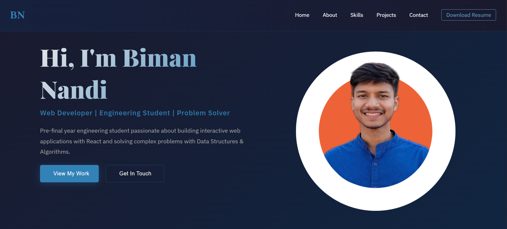

# 🌐 Personal Portfolio Website

This is my personal portfolio website built to showcase my projects, skills, and experience as a Frontend Developer.

🚀 Live Demo: https://biman-nandi-portfolio.netlify.app/  
---

## ✨ Features

- Responsive design (mobile + desktop)
- Modern UI with clean layout  
- Projects showcase with live demos  
- About me & contact section  
- Fast performance

---

## 🛠 Tech Stack

- React.js  
- HTML5  
- CSS3  
- JavaScript  
- Vite / Create React App (whichever you used)

---

## 📸 Screenshots

  
---

## 📁 Folder Structure

portfolio/
├── public/
├── screenshots/
├── src/
│ ├── components/
│ ├── pages/
│ └── App.jsx
├── package.json
└── README.md


---

## ⚙️ Installation & Setup

```bash
git clone https://github.com/bimannandib/my-portfolio.git
cd portfolio
npm install
npm run dev
🧠 What I Learned
Component-based architecture in React

Deploying frontend apps using Netlify

Managing state and props in React

📬 Contact
LinkedIn: https://linkedin.com/in/biman-nandi-bn

Email: bimannandib@gmail.com

Portfolio: https://biman-nandi-portfolio.netlify.app/
